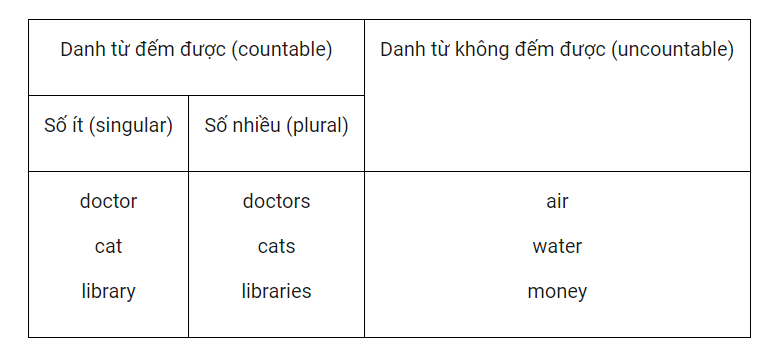

# Noun

__Danh từ (Noun)__ là tên gọi của người, động vật, sự vật,
nơi chốn, hiện tượng, khái niệm...

Danh từ được chia thành hai loại: __danh từ đếm được__ và _
_danh từ không đếm được__;
danh từ đếm được có hai dạng: __số ít__ và __số dnhiều__.
\
Lưu ý: một số danh từ vừa là danh từ đếm được vừa là danh từ
không đếm được tùy từng tình huống. VD: hope,
expectation,...

VD: What are your hopes and dreams for the future?\
I don't hold much hope of getting a ticket.\
Các từ hạn định đứng trước danh từ để giới hạn ý nghĩa cho
danh từ đó. VD: a book, my cats, these libraries, much
water…

Lưu ý: Trong nhiều trường hợp,từ hạn định có sự thay đổi tùy
thuộc vào danh từ đó là danh từ đếm được hay không đếm
được, số ít hay số nhiều: chẳng hạn, a book là cách nói
đúng, a water là cách nói sai; these libraries là cách nói
đúng,
these library là cách nói sai, many cats là cách nói đúng,
much cats là cách nói sai. 