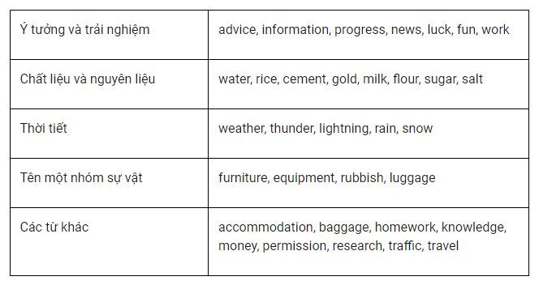

**1.2. Danh từ không đếm được (uncountable noun)**\
Ví dụ về danh từ không đếm được thường gặp:

VD: We’re going to get new furniture for the living room. (
We’re going to get a new furniture for the living room. or
We’re going to get new furnitures for the living room.)

       Chúng ta sẽ mua nội thất mới cho phòng khách.
       We had terrible weather last week.
       Chúng tôi đã trải qua thời tiết rất tệ vào tuần trước.
       We need rice next time we go shopping.
      Chúng ta cần (mua) gạo lần tới đi chợ.          

Danh từ không đếm được dễ bị nhầm lẫn: nhiều danh từ kết
thúc với đuôi -s dễ bị nhầm thành danh từ số nhiều nhưng
thực chất lại là danh từ không đếm được.

VD: Gymnastics is my favorite sport. (Gymnastics are…)

       Thể dục dụng cụ là môn thể thao yêu thích của tôi. 

       What time is the news on TV? (..are the news…)

       Mấy giờ chiếu thời sự trên TV?